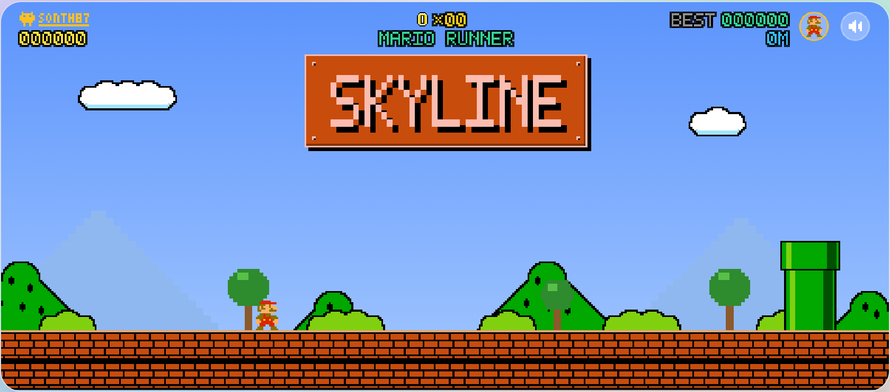
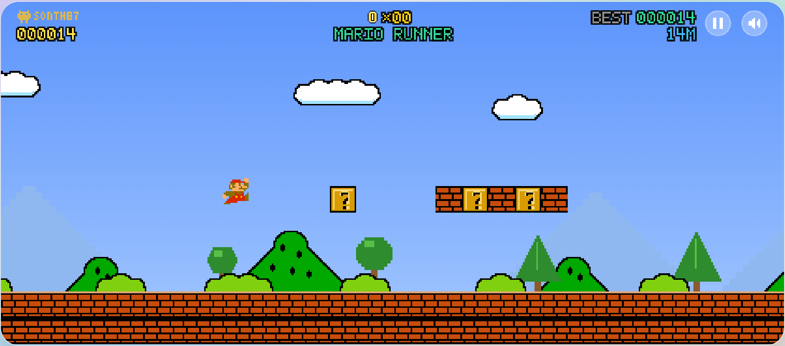
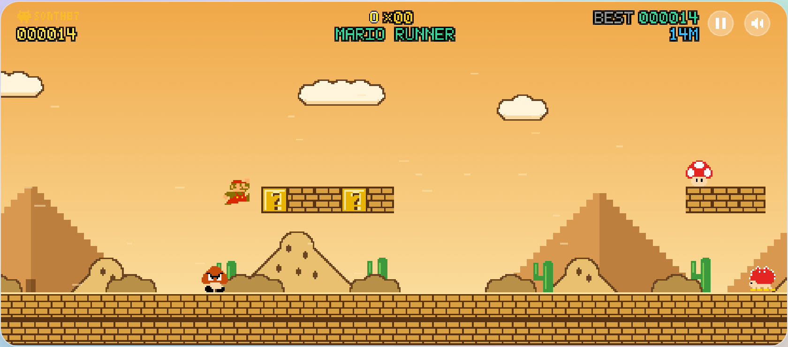
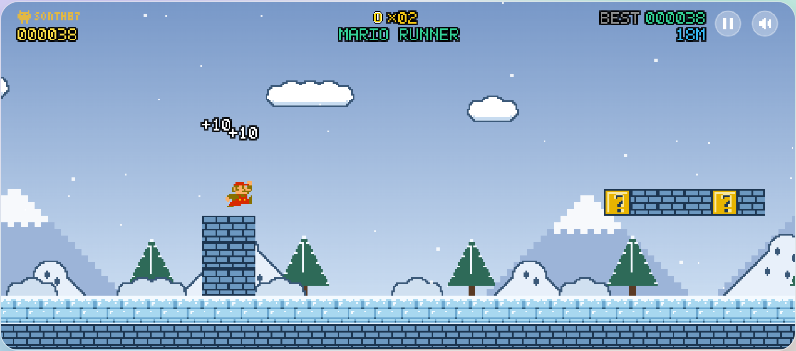
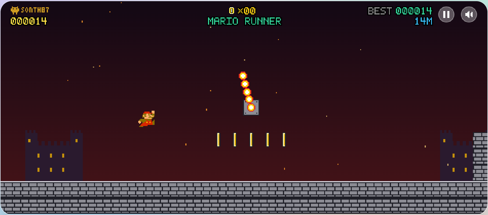
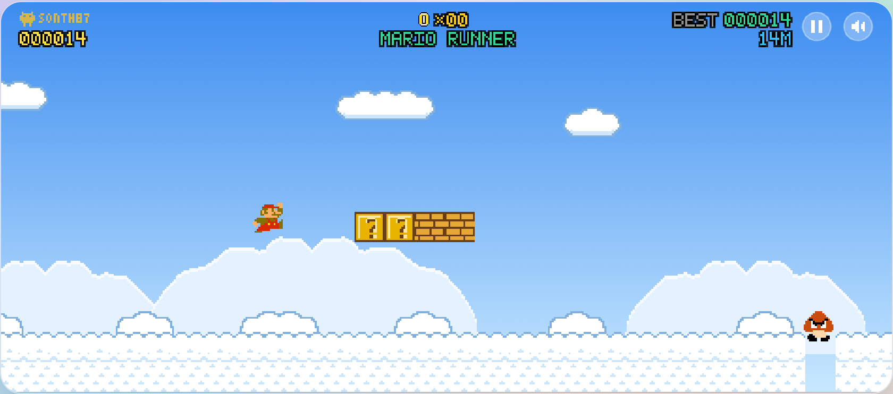

# @sonth87/mario-tap

Mini game kiểu Mario **một nút bấm**. Mario tự chạy, gặp vật cản thì quay đầu. Người chơi chỉ **nhảy**, bằng cách click chuột (nút nào cũng được), nhấn Space hoặc chạm màn hình; không có thao tác nào để điều khiển hướng đi. Màn chơi sinh vô hạn và lưu điểm cao nhất.

<table>
<tr>
<td></td>
<td></td>
<td></td>
</tr>
<tr>
<td></td>
<td></td>
<td></td>
</tr>
</table>

Thêm ảnh màn tạm dừng, GAME OVER và các trạng thái lên mây / dây leo trong [screenshots/](screenshots/) (tạo lại bằng skill `/run-mario-tap`).

- Canvas 2D, **không có runtime dependency**. React là tùy chọn (`@sonth87/mario-tap/react`).
- Sprite là pixel art viết bằng chuỗi ký tự; âm thanh tổng hợp bằng Web Audio. Không có file asset nào.
- Package giao thẳng mã nguồn TypeScript (không có bước build). Dùng được với Vite, Next và mọi bundler hiểu TS.
- HUD dựng sẵn trong canvas: credit, điểm, xu, kỷ lục, số mét, ảnh nhân vật, nút loa (docs/integration.md §7).
- **Chạy độc lập**, không cần app chủ: `pnpm dev` mở trang demo (`demo/`); `pnpm build` ra site tĩnh trong `dist/`, mở ở đâu cũng chạy.
- **Độ khó tăng dần**: mỗi cột cờ tăng tốc độ một bậc (tối đa 150%) và chuyển biome (đồng cỏ → sa mạc → tuyết → lâu đài → **trên mây** → đồng cỏ…), mỗi biome có luật riêng: Spiny, mặt băng trơn, fire bar, cây ăn thịt trong ống; lên mây bằng các bậc lơ lửng, xuống lại bằng dây leo, trên mây có mây gai và chim (docs/gameplay.md §8).
- Có **tạm dừng** (nút ⏸, Esc / P), chuỗi đạp nhân đôi điểm, hit-stop, rung màn hình, bụi, thời tiết theo biome; tôn trọng `prefers-reduced-motion`.
- **Nhạc nền**: mặc định không có; app tích hợp truyền URL của mình qua option `music` (có thể theo từng biome).
- Tùy biến được: **theme** (màu trời, 5 lớp nền parallax gồm núi, mây, đồi, cây, bụi; màu khối/ống/cột cờ; 8 theme dựng sẵn, ghi đè được theo từng biome), **nhân vật** (17 nhân vật dựng sẵn hoặc nhân vật tự định nghĩa), chữ hiển thị, âm thanh, cách lưu điểm.

```tsx
import { MarioGame } from '@sonth87/mario-tap/react';

<MarioGame className="h-[360px] w-full" storageKey="my-app:mario-best" theme="night" character="peach" onGameOver={(s) => console.log(s.score)} />
```

```ts
import { createMarioGame } from '@sonth87/mario-tap';

const game = createMarioGame(document.getElementById('stage')!, { muted: true });
// game.press() · pause() · resume() · restart() · update({ theme, biomes, music }) · openCharacterPicker() · setCharacter(id) · getStats() · destroy()
```

| Tài liệu | Nội dung |
|---|---|
| [docs/integration.md](docs/integration.md) | Tích hợp vào dự án khác: props/options, callback, lưu trữ, i18n, kích thước, phím |
| [docs/gameplay.md](docs/gameplay.md) | Luật chơi đầy đủ: vật lý, khối, vật phẩm, quái, điểm |
| [docs/level-design.md](docs/level-design.md) | Cách viết chunk màn chơi, giới hạn bắt buộc, trình kiểm tra `validate` |
| [docs/architecture.md](docs/architecture.md) | Cấu trúc thư mục, vòng lặp, chiều import, cách test |

Lệnh (chạy trong thư mục của project này, sau `pnpm install`):

| Lệnh | Việc |
|---|---|
| `pnpm dev` | trang demo độc lập tại http://localhost:5190 (chọn theme, chọn biome, bật/tắt parallax, tắt tiếng) |
| `pnpm build` | build demo thành site tĩnh `dist/` (đường dẫn tương đối) |
| `pnpm typecheck` | `tsc` cho src + scripts + tests + demo |
| `pnpm test` | test logic (vật lý, va chạm, bộ sinh màn, bot soak 60k frame) |
| `pnpm validate` | chứng minh mọi chunk đều vượt qua được bằng chính engine vật lý, ở mọi biome, tốc độ đầu và tốc độ tối đa (khoảng 3 phút) |
